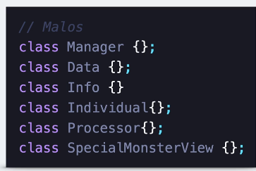
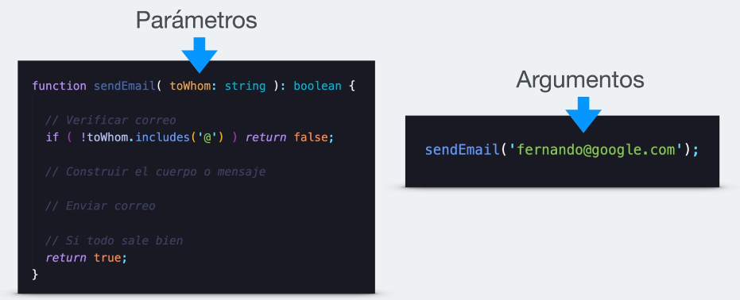

# SOLID AND CLEAN CODE

## Consideraciones para las clases
* Nombres coherentes.
* Formando por un sustantivo o frases de sustantivo
* No deben de ser genericos
* Usar UpperCamelCase
* mas palabras !== mejor nombre

## Funciones
* Nombre de las funciones tiene que ser lo que exactamente dice la funcion.
* Lo correcto es limitar una funcion que contenga tres parametros posicionales.

